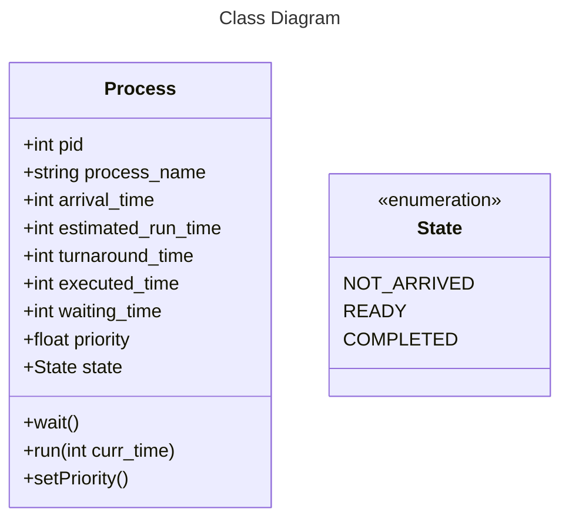

# CSE - 316 (Operating System) Assignment - 2

**Question 2** - Consider a scheduling approach which is pre-emptive similar to shortest remaining time first in nature. The priority of each job is dependent on its estimated run time, and also the amount of time it has spent waiting. Jobs gain higher priority the longer they wait, which prevents indefinite postponement. The jobs that have spent a long time waiting compete against those estimated to have short run times.

The priority can be computed as : `Priority = 1 + Waiting time / Estimated run time`

Write a program to implement such an algorithm. Ensure -
1. The input is given dynamically at run time by the user
2. The priority of each process is visible after each unit of time
3. The gantt chart is shown as an output
4. Calculate individual waiting time and average waiting time

## Code Overview

### Functions -
- `Process::run()`: 
- `Process::wait()`: 
- `Process::setPriority()`: 
- `vector<Process *> get_processes()`: Takes dynamic user input for the process name, arrival time and estimated run time of processes and returns a vector of processes sorted by arrival time
- `void print_process_table(vector<Process *> processes)`: Takes argument processes, a vector of Processes and prints a formatted table of the processes, with process_name, arrival_time and estimated_run_time to console.
- `void print_priority(int curr_time, vector<Process *> processes)`: Takes arguments curr_time and process, a vector of Processes and prints a formatted table of the processes with process_name and priority, along with current time to console.
- `void run_process(vector<Process *> processes)`:
   - Main execution function that runs the scheduling algorithm. Function initialises a `curr_time` variable to 0, an empty `ready_queue` vector of processes and `job_queue` queue of processes which contains all the processes from the processes vector in-order of arrival time.

   - At a certain value of counter variable curr_time, pop all processes in job_queue with arrival_time == curr_time, push them to the ready_queue and set their state to READY. Find the highest priority process in the ready_queue, print priority table of all processes with READY state using the `print_priority` function. Iterate through `ready_queue`, run the process with highest priority and wait all the rest processes. Re-calculate priority for all processes in `ready_queue`. If last run process was completed, remove it from ready_queue.

   - The above loops until both job_queue and ready_queue are empty, incrementing curr_time by 1 after each iteration. 
- `void print_gantt_chart()`: Prints gantt chart from the stored processes in `running_queue`.
- `void print_waiting_time(vector<Process *> processes)`: Prints formatted table with process names, arrival times, turnaround times, estimated run times, waiting times and calculate and prints average waiting time for all the processes executed.

## Outputs

### Output - 1

3 Processes A, B and C with the following arrival times and estimated run times were dynamically inputted -

| Name | Arrival Time| Estimated Run Time |
| :-: | :-: | :-: |
| A  | 1  | 2 |
| B  | 1  | 5 |
| C  | 3  | 3 |

### Output - 2

2 Processes A and B and C with the following arrival times and estimated run times were dynamically inputted -

| Name | Arrival Time| Estimated Run Time |
| :-: | :-: | :-: |
| A  | 0  | 1 |
| B  | 0  | 2 |

